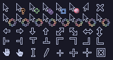

# Neutral++ Catppuccin

## About

It's a fork of the [Neutral++](https://github.com/ducakar/xcursor-neutralxx) xcursor theme, with Catppuccin Mocha color scheme.

## Changes

- Changed the base black and white color scheme to Catppuccin Mocha pallette
- Added green color to the dnd-copy
- Added peach color to the question_arrow
- Added mauve color to the dnd-link
- Added blue color to the dnd-move
- Changed the red color to the dnd-circle
- Added colors to the left_ptr_watch

All files from original repository got updated. 

## Installation

Go to source subdirectory and run ./make.sh script. This will create a `cursors` folder.
Create a new directory under `/usr/share/icons` (e.g. `NeutralCatppuccin++`) and move the `cursors` folder there.
Then, update the `~/.icons/default/index.theme` file to use the newly added cursors.
Alternatively, use an application like [lxappereance](https://man.archlinux.org/man/lxappearance.1.en) to set the cursor.

## Thanks

Thanks to Davorin Učakar for the curosrs I've based on, Alexey Nikitine for the Neutral, Björn Janßen for the Neutral Plus and the unknown author for the jaguarx theme.

Neutral, jaguarx and Neutral++ are all covered by Aristic License
(see LICENSE file) and can be found on http://www.kde-look.org/.

Jakub Owczarek <jakub.jan.owczarek@gmail.com>, 24th March 2024
